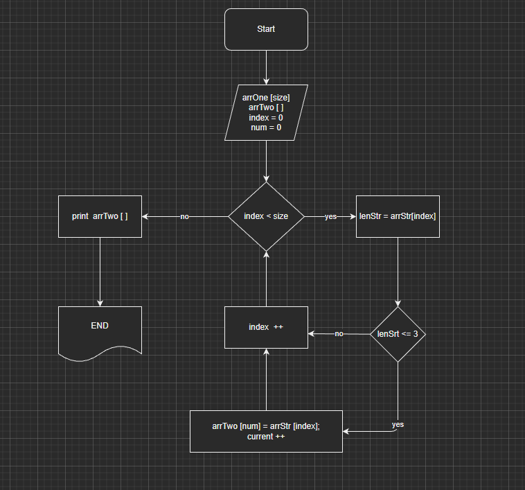

# Итоговой проверочной работы
___
### Задание:
> 
    1. Создать репозиторий на GitHub
    2. Нарисовать блок-схему алгоритма (можно обойтись блок-схемой основной содержательной части, если вы выделяете ее в отдельный метод)
    3. Снабдить репозиторий оформленным текстовым описанием решения (файл READEME.md)
    4. Написать программу, решающую поставленную задачу
    5. Использовать контроль версий в работе над этим небольшим проектом (не должно быть так что все залито одним коммитом, как минимум этапы 2, 3 и 4 должны быть расположены в разных коммитах)
___
#### Задача: 
Написать программу, которая из имеющегося массива строк формирует массив из строк, длина которых меньше либо равна 3 символа. Первоначальный массив можно ввести с клавиатуры, либо задать на старте выполнения алгоритма. При решении не рекомендуется пользоваться коллекциями, лучше обойтись исключительно массивами.
#### Примеры:
    [“Hello”, “2”, “world”, “:-)”] → [“2”, “:-)”]
    [“1234”, “1567”, “-2”, “computer science”] → [“-2”]
    [“Russia”, “Denmark”, “Kazan”] → []
___
# Алгоритм решения
> 
    1. Перебирпем значения исходного массива.
    2. Проверяем каждое знаение массва по очереди на соответствие условию: длинна строки меньше или равна трем (3).
    3. Если условия выполняются выбранной строкой из исходного массива то данное значение кладем в новый массив.
    4. Повторяем пункты 2 и 3 до тех пор пока не достигнем конца исходного массива.
    6. Возращаем новый заполненый массив как результат.
# Блок-схема

